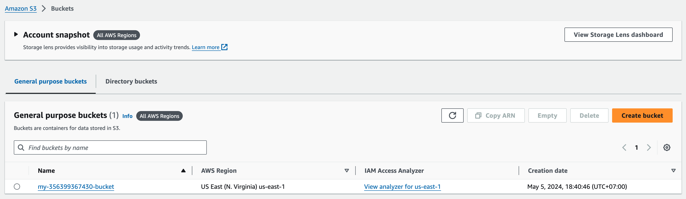
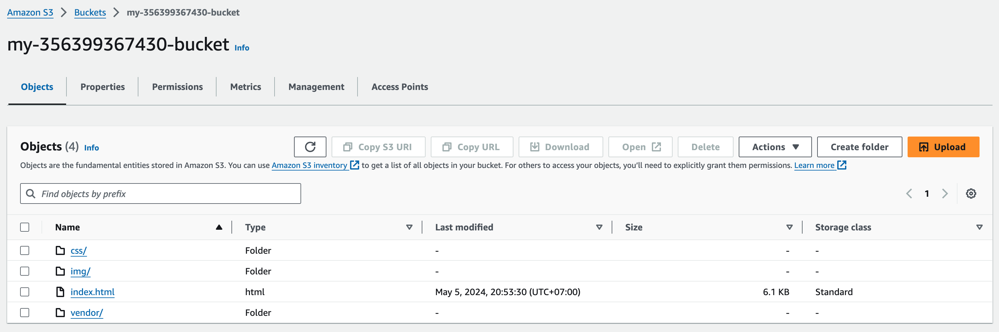
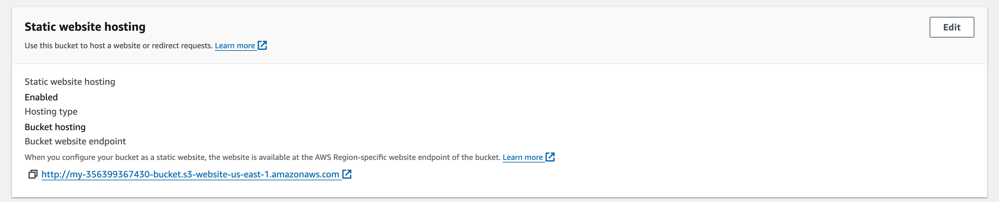
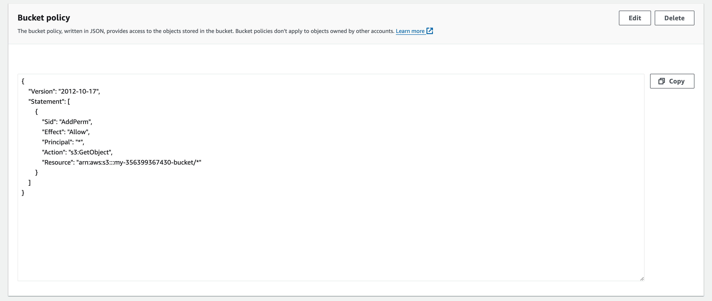
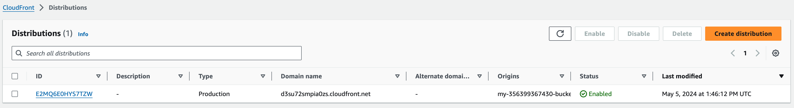
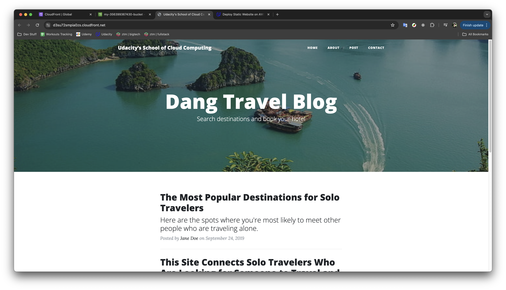

# Deploy Static Website on AWS
## Website Files
- The S3 bucket is created.

The student has submitted a screenshot showing all the website files uploaded to the newly created S3 bucket.

- The S3 bucket is configured to support static website hosting.

- The S3 bucket has an IAM bucket policy that makes the bucket contents publicly accessible.

## Website Distribution
CloudFront has been configured to retrieve and distribute website files.

## Web Browser Access
- CloudFront domain name URL: https://d3su72smpia0zs.cloudfront.net
- Website-endpoint URL: http://my-356399367430-bucket.s3-website-us-east-1.amazonaws.com

